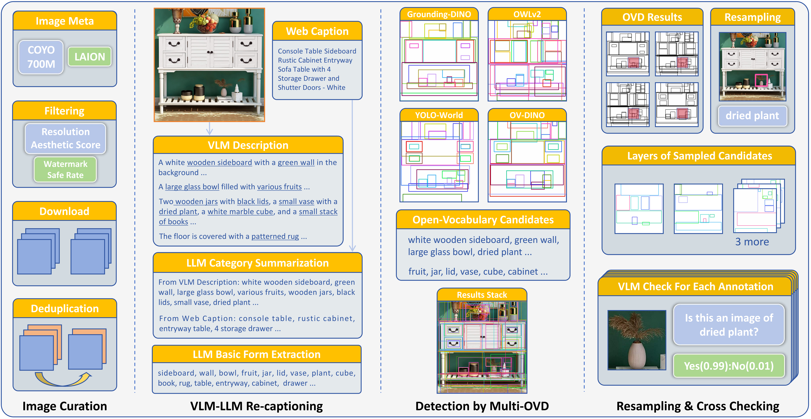

# ROVI: A VLM-LLM Re-Captioned Dataset for Open-Vocabulary Instance-Grounded Text-to-Image Generation

## Overview

ROVI is a high-quality synthetic dataset featuring 1M curated web images with comprehensive image descriptions and bounding box annotations. Using a novel VLM-LLM re-captioning strategy, ROVI exceeds existing detection-centric datasets in image description, quality, and resolution, while containing two orders of magnitude more categories with an open-vocabulary nature. Our approach yields a global prompt inherently linked to instance annotations while capturing secondary visual elements humans typically overlook.

**This work is accepted at ICCV 2025.** For demonstrative purposes, an instance-grounded T2I generator based on [GLIGEN](https://github.com/gligen/GLIGEN) trained on ROVI achieves superior performance in grounding accuracy, prompt fidelity, and aesthetic quality.

**Paper:** [ArXiv](TBD) | [ICCV 2025](https://iccv.thecvf.com/virtual/2025/poster/245)

**Dataset:** [ROVI Dataset on Hugging Face](https://huggingface.co/datasets/CHang/ROVI)

**Demo:** [ROVI Dataset Example Viewer](https://huggingface.co/spaces/CHang/ROVI-Dataset-Example-Viewer) - This demo will fetch a random 1k subset from ROVI val set, and display up to 100 random images with rich annotations.

## Dataset Structure

The dataset is provided in JSON format with train and validation splits:

- **Train Set:** 981,551 samples (keys: '0000001' - '0981551')
- **Validation Set:** 30,153 samples (keys: '0981552' - '1011704')

Each sample is stored as a dictionary with a 7-digit key and contains the following fields:

### Core Fields

- **`url`**: Image URL
- **`source`**: Data source with quality filtering
  - `laion_aes`: From [LAION-5B](https://laion.ai/blog/laion-5b/) with aesthetic score ≥ 6.0
  - `coyo_6plus`: From [COYO-700M](https://github.com/kakaobrain/coyo-dataset) with aesthetic score ≥ 6.0  
  - `coyo_add`: From [COYO-700M](https://github.com/kakaobrain/coyo-dataset) with aesthetic score 5.75-6.0
  - `laion_pop`: From [LAION-POP](https://laion.ai/blog/laion-pop/) for diversity (high average aesthetic score)
- **`width`**, **`height`**: Image dimensions
- **`box_num`**: Number of bounding boxes
- **`category_num`**: Number of distinct categories in the sample

### Caption Fields

- **`web_caption`**: Original caption from source metadata (LAION-5B, COYO-700M, or LAION-POP)
- **`vlm_description`**: Generated description using [InternVL-1.5](https://huggingface.co/OpenGVLab/InternVL-Chat-V1-5) (as described in paper pipeline)

### Tokenization Information

- **`web_clip_tok_num`**, **`vlm_clip_tok_num`**: Token counts based on CLIP tokenizer
- **`web_clip_last_sentence_idx`**, **`vlm_clip_last_sentence_idx`**: Character index for complete last sentence when using 77-token CLIP limit

### Metadata

- **`phash`**: Perceptual hash for deduplication
- **`source_meta`**: Unique source information inherited from original metadata

### Annotations

All annotation fields (`labels`, `bboxes`, `scores`, `ovd_belongings`) are lists of the same length.

- **`labels`**: Open-vocabulary object labels (strings)
- **`bboxes`**: Bounding box coordinates (xyxy format)
- **`scores`**: Detection confidence scores (may vary across detectors)
- **`ovd_belongings`**: Detection source attribution
  - `gd`: [Grounding-DINO](https://github.com/IDEA-Research/GroundingDINO)
  - `yw`: [YOLO-World](https://github.com/AILab-CVC/YOLO-World)
  - `ow`: [OWLv2](https://huggingface.co/docs/transformers/en/model_doc/owlv2)
  - `od`: [OV-DINO](https://github.com/wanghao9610/OV-DINO)

## Pipeline Stages

Our pipeline implements a novel VLM-LLM re-captioning strategy that enables comprehensive object detection across open-vocabulary categories, relying solely on open-source models. The key innovation is pre-detection re-captioning: by invoking VLM-LLM processing before detection, we create accurate and comprehensive object lists that allow broader instance detection using the same Open Vocabulary Detectors (OVDs). This approach also mitigates bias in source dataset text, significantly increasing overall consistency.

The pipeline consists of five sequential stages, each building upon the previous outputs:

### Stage 1: VLM Description ([`vlm_description/`](vlm_description/))

**Purpose**: Generate comprehensive image descriptions using Vision-Language Models  
**Model**: [InternVL-Chat-V1.5](https://huggingface.co/OpenGVLab/InternVL-Chat-V1-5) (26B parameters)  
**Process**: Takes curated web images and generates detailed visual descriptions that capture both primary objects and secondary visual elements often overlooked by humans  
**Output**: VLM-generated captions paired with original web captions  
**Details**: See [`vlm_description/README.md`](vlm_description/README.md) for setup, usage, and configuration

### Stage 2: LLM Summarization ([`llm_summarization/`](llm_summarization/))

**Purpose**: Extract and refine object categories from image descriptions  
**Model**: [Llama3-8B-Instruct](https://huggingface.co/meta-llama/Meta-Llama-3-8B-Instruct)  
**Process**: Two-phase approach:
- **Phase 1**: Extract structured attributes and compound phrases from VLM descriptions and web captions
- **Phase 2**: Decompose complex phrases into constituent parts and remove redundancies

**Output**: Clean, comprehensive lists of potential objects for detection  
**Details**: See [`llm_summarization/README.md`](llm_summarization/README.md) for model setup and processing pipeline

### Stage 3: Multi-OVD Detection

**Purpose**: Detect objects using multiple Open Vocabulary Detectors for comprehensive coverage  
**Models Used**:
- [Grounding-DINO](https://github.com/IDEA-Research/GroundingDINO)
- [YOLO-World](https://github.com/AILab-CVC/YOLO-World) 
- [OWLv2](https://huggingface.co/docs/transformers/en/model_doc/owlv2)
- [OV-DINO](https://github.com/wanghao9610/OV-DINO)

**Process**: Apply multiple OVDs to detect objects from the LLM-generated category lists  
**Implementation**: These are well-established methods and models, so users can refer to the official repositories for implementation details. We recommend maintaining raw detection results without heavy processing (such as high score thresholds or NMS). For the safety thresholds we used in following stages, please refer to [`thresholds in resampling`](resampling/ovd_resample.py#L127)  
**Output**: Dense detection results from multiple OVD sources with bounding boxes and confidence scores

### Stage 4: OVD Resampling ([`resampling/`](resampling/))

**Purpose**: Intelligent utilization of dense, overlapping multi-OVD results before VLM cross-checking to reduce computational overhead
**Process**: Implements a 5-stage sampling strategy:
- Preprocessing and filtering (score thresholds, area constraints)
- Overlap removal and Non-Maximum Suppression per OVD
- Adaptive sampling to balance contributions across OVD sources
- IoU-based selection with overlap punishment
- Final selection with comprehensive overlap punishment

**Output**: Curated, high-quality detection candidates with reduced redundancy  
**Details**: See [`resampling/README.md`](resampling/README.md) for configuration and resampling methodology

### Stage 5: VLM Cross-Checking ([`vlm_cross_checking/`](vlm_cross_checking/))

**Purpose**: Filter invalid box-label pairs through VLM verification
**Model**: [Qwen2-VL-7B-Instruct](https://huggingface.co/Qwen/Qwen2-VL-7B-Instruct)  
**Process**:
- Crop detected regions from images
- Ask VLM yes/no questions: "Is this an image of {object}?"
- Apply probability-based refinement to address VLM yes-bias
- Filter false positive detections

**Output**: Final verified bounding box annotations with confidence scores  
**Details**: See [`vlm_cross_checking/README.md`](vlm_cross_checking/README.md) for verification methodology and setup

**Note**: Since multiple open-source models with diverse requirements are involved, we recommend creating separate environments for each stage to avoid potential dependency conflicts. Each stage's README provides detailed setup instructions.

## Related Repositories

Our pipeline relies solely on open-source models and all third-party code can be run offline with downloaded weights. The key open-source models used in our pipeline include:

- **InternVL-1.5**: [OpenGVLab/InternVL-Chat-V1-5](https://huggingface.co/OpenGVLab/InternVL-Chat-V1-5)
- **LLaMA-3**: [meta-llama/llama3](https://github.com/meta-llama/llama3)
- **Qwen2-VL**: [Qwen/Qwen2-VL-7B-Instruct](https://huggingface.co/Qwen/Qwen2-VL-7B-Instruct)
- **Grounding-DINO**: [IDEA-Research/GroundingDINO](https://github.com/IDEA-Research/GroundingDINO)
- **YOLO-World**: [AILab-CVC/YOLO-World](https://github.com/AILab-CVC/YOLO-World)
- **OWLv2**: [OWLv2 on HuggingFace](https://huggingface.co/docs/transformers/en/model_doc/owlv2)
- **OV-DINO**: [wanghao9610/OV-DINO](https://github.com/wanghao9610/OV-DINO)

## License

This dataset is released under [CC BY 4.0](https://creativecommons.org/licenses/by/4.0/) license.

## Limitations

- Image availability may change over time as URLs become inaccessible
- Detection annotations are generated automatically and may contain errors
- Minor language model artifacts persist, including inconsistent singular/plural handling and awkward phrasing
- Bounding box grounding may be less accurate for visually occluded objects and non-contiguous elements

For more detailed discussion, please refer to our paper and supplementary materials.

## Acknowledgments

We thank the LAION-5B and COYO-700M programs for providing the foundational image datasets, and the authors and contributors of InternVL-1.5, LLaMA-3, Qwen2-VL, Grounding-DINO, YOLO-World, OWLv2, and OV-DINO for their outstanding work and contributions to the open-source community, which made this dataset possible.

## Contact

For questions or issues regarding this dataset, please contact: cihangpeng@zju.edu.cn
